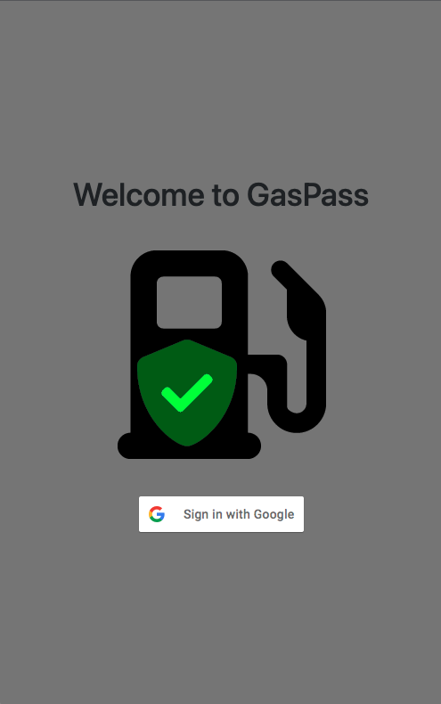

# Welcome To GasPass

An automated solution for managing weekly employee fuel allowances and transactions. What started as a logistical nightmare in managing fuel receipts, employee eligibility, and business-to-business communication is now managed via a simple, mobile-first web application.

## Getting Started

## Screenshots

## Technologies Used
- MongoDB
- Express
- Node
- Bootstrap
- Font Awesome
- HTML
- CSS

 

This app uses a simple [random key generator](https://www.npmjs.com/package/random-key-generator) to issue random 6 digit codes to the user.

## Ice Box
- Automate the weekly balance refill function using Heroku Scheduler
- Add an admin function that locks new user signup
- Add a demo mode so that once new users are locked, someone can still preview the features without disrupting the live data.
- Generate a weekly transaction report
- Add an admin function to deactive/reactivate users

## Credits
- badges in the getting started section of this document created by [shields.io](https://shields.io/)
- logo created using Font Awesome svg

